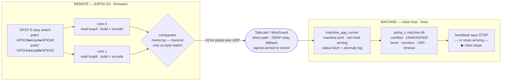

# Protective stop

A low-cost, reliable protective stop for robots and automation. A
battery-powerable ESP32-S3 remote heartbeats operator intent at 10 Hz
over an encrypted tunnel to a machine process on the robot. If the
heartbeats say STOP, or stop arriving at all, the machine brings the
robot to a controlled stop.

Safety scope: this is a protective stop (a controlled, preventative
shutdown), not an emergency stop. It is not a substitute for an E-stop
where there is an immediate threat to people or equipment.

The wire protocol and the machine-side safety state logic are the
[`pstop_c`](pstop_c/) library, kept on its own certification track and
never modified elsewhere in this repo. Everything around it (firmware,
transport, sensing, supervision, and the machine wrapper) is the open
engineering shell that turns `pstop_c` into a deployable device.

## How it works

The remote (Waveshare ESP32-S3-ETH, W5500 PoE Ethernet) senses a
physical DPST normally-closed E-stop switch through two independent
loopback channels, one per CPU core. The two cores run in lockstep:
each reads its own loop and independently builds the 40-byte pstop
message, and a comparator transmits only when the two encodings are
byte-identical (2oo2 to run, 1oo2 to stop). Any disagreement, loop
fault, or stalled task sends nothing, and the machine's heartbeat
timeout stops the robot. Every failure mode degrades to "no message,"
and no message is a stop.

pstop traffic rides Tailscale/WireGuard with automatic uplink failover
(Ethernet, then USB-NCM, then WiFi) and DERP relay fallback. Egress is
pinned to the tunnel, so a downed VPN fails safe instead of leaking
plaintext. The remote establishes the link itself: it homes its DERP
connection on the machine's region and initiates the handshake, so no
manual `tailscale ping` from the robot side is needed, and it
re-establishes on its own after either end reboots. On a shared subnet
the remote also advertises its LAN address so peers can take the direct
local path instead of the relay. The machine wrapper adds a
minimum-hold arming policy so an electrical blip can never perform the
arming gesture.



## Repo layout

| Path | What |
|---|---|
| [`pstop_c/`](pstop_c/) | Certified protocol + machine-safety C library. Its own track; do not modify here, contribute upstream. |
| `firmware/` | ESP-IDF 5.5 remote firmware (`pstop_remote`). `main/main.c` is the auditable lockstep core; `components/dcs_support/` is the shell (boot, OTA+rollback, admin UI, failover, telemetry). |
| `components/` | `microlink/` (Tailscale/WireGuard/DERP), `ml_dev_tether/` (USB-CDC-NCM), `pstop/` (ESP-IDF glue that compiles `pstop_c/`). |
| `host/` | `machine_app_runner` + `machine.toml`, the robot-side machine wrapper. |
| `tools/` · `test/` | Wire-accurate test remote, chaos proxy, MISRA check, bulk USB flasher; bench chaos/soak/netem ladders. |
| `docs/` | Design records, test reports, safety/recovery playbooks (`docs/archive/` holds historical records). |
| `hardware/` | Enclosure CAD + board schematic (work in progress, see `hardware/README.md`). |
| `archive/` | Deprecated ROS 2 / Foxglove packages, kept for reference pending removal. |

## Quickstart

Remote firmware:

```sh
cp firmware/sdkconfig.credentials.example firmware/sdkconfig.credentials   # WiFi + Tailscale creds
cd firmware && source ~/esp-idf-5.5/export.sh && idf.py build
```

The first flash is over the wire. Hold BOOT and tap RST for ROM
download mode, since TinyUSB owns USB-OTG at runtime:

```sh
idf.py -p /dev/ttyACM0 flash
```

Every update after that goes over the network:

```sh
curl -u admin:<pw> --data-binary @build/pstop_remote.bin http://<chip>/admin/api/ota
```

This direct upload is also the recovery path for a unit the fleet
server can't reach or update, for example one wedged with a bad DERP
home so its fleet check-in fails. If you can reach the unit's admin
server at all (LAN, USB tether at `10.42.0.1`, or its Tailscale IP from
a same-region or direct peer), push a known-good `pstop_remote.bin` and
it flashes, reboots, and self-heals. Verified 2026-07-22 recovering a
unit stuck advertising the wrong DERP region.

Machine (robot host), which needs only `cc` and `make`, no ESP-IDF:

```sh
cd host && make && ./machine_app_runner machine.toml     # listens on 0.0.0.0:8890
curl -X POST "http://<chip>/api/pstop_peer?ip=<machine-ip>&port=8890"
```

Arm by pressing and holding the switch for at least 0.5 s, then
releasing. The runner logs `ARMED` and the ring turns green.

## Key facts

- 10 Hz heartbeat; stop-on-silence is `heartbeat_ms ×
  (max_missed_heartbeats+1)`, about 1 to 2 s as configured.
- Arming: a STOP held shorter than `min_stop_ms` (default 500 ms) is
  vetoed machine-side. The remote also debounces loop re-close by 3
  ticks and holds all transmission until the loops settle at boot, so
  an EMC blip can't arm.
- Fail-safe silence: lockstep mismatch, loop fault, VPN-down
  (source-bound socket), and comparator stall all result in no message,
  which the machine treats as STOP.
- Interfaces: Ethernet, then USB-NCM, then WiFi, supervised at 1 Hz
  with automatic default-route failover. 128-peer Tailscale capacity
  with priority-peer latency isolation. Nothing in this repo assumes a
  particular LAN.
- Identity: each remote derives a stable per-unit ID from its MAC. The
  Tailscale node `pstop-01xxxxxx` matches its pstop device ID
  `0x01xxxxxx`, and the node record and VPN IP persist across reboot
  and OTA.
- Recovery chain: task watchdog, then network-liveness watchdog, then
  crash counter, then OTA rollback, all button-free
  (`docs/SAFETY_CHAIN.md`, `docs/RECOVERY_PLAYBOOK.md`).
- Status ring: white = no machine configured, pulsing red = machine
  unreachable, blue = bonded, green = armed, solid red = STOP, purple =
  lockstep mismatch (`docs/TROUBLESHOOTING.md`). The ring mounts in any
  of 16 rotations, so which pixel is "LED 1" is a per-device setting:
  `POST /api/ring_offset?n=0..15`, with a locate mode
  (`POST /api/ring_led1?on=1`) that lights only LED 1 for calibration.
- HTTP API: diagnostic/config on port 80 plus password-protected
  `/admin/*` routes. Full reference in [`docs/API.md`](docs/API.md).

## Testing and static analysis

`docs/TESTING.md` documents the full harness:
`tools/pstop_test_remote.py` (arming-policy suite over the real wire
protocol), `tools/pstop_chaos_proxy.py` + `test/chaos_ladder.sh`
(loss/delay/dup/corrupt ladder), and `test/netem_ladder.sh`
(WireGuard-underlay chaos). The simulated-press endpoint (`pstop_sim`)
was removed from production firmware; tests exercise the machine policy
through the scripted test remote instead, and arming a real unit
requires a physical press.

`./tools/misra_check.sh` runs a free-cppcheck MISRA C:2012 pass over
the code we own (`pstop_c` is excluded; see
`docs/MISRA_COMPLIANCE_2026-07-21.md` for results and the deviation
register).

Validated across USB, Ethernet, and WiFi with soaks and impairment
ladders producing zero false stops and zero device crashes
(`docs/archive/TRANSPORT_TEST_REPORT_2026-07-20.md`,
`docs/archive/CHAOS_RESULTS_2026-07-20.md`), on a live 128-peer
tailnet, and on a live two-site rig against a geographically remote
machine. In that run a full blackhole of the direct WireGuard path was
carried by DERP with zero gap and zero rebonds, any single-path failure
left the heartbeat intact, and a total link loss degraded to STOP with
autonomous recovery in about 3 to 6 s
(`docs/TWO_SITE_FAILOVER_2026-07-21.md`). Many-remotes-to-one-machine
logic is validated in `docs/MULTI_REMOTE_VALIDATION_2026-07-22.md`.

## Current status and open items (2026-07-22)

Fleet integration works end to end: units self-provision (per-unit ID,
auto-join Tailscale), check in on boot and at least every 5 minutes,
and are managed and updated from the fleet server
(`docs/FLEET_SERVER.md`). Inbound fleet reachability required a
DERP-home fix so a NAT'd or tethered unit homes on the fleet's region
(`docs/TROUBLESHOOTING.md`). Bulk USB provisioning goes through
`tools/flash_pstop.sh`.

Open items:

- WiFi is the weakest transport, at roughly 98 % soak reply rate with a
  fail-safe stop and self-heal burst every 10 to 15 minutes. Deployment
  policy: Ethernet primary, WiFi fallback, USB-NCM for bench and
  service.
- Retune machine `max_lost_messages` (10 to about 20) so the heartbeat
  timeout, not the counter gap, is the stop authority on WiFi.
- Tailscale subnet-route caveat: a subnet router advertising the
  robot's LAN hijacks operator-laptop traffic to the chip's LAN IP.
  There is an `ip rule` workaround that needs documenting for the
  fleet.
- USB-tether units behind symmetric NAT are relay-only (no direct
  path) and depend on the DERP re-home. Reachable in testing after
  recovery, but worth a dedicated soak.
- Long-duration (24 h+) per-transport soaks before certification runs.

## Certification and licensing

`pstop_c/` is on its own certification track and is never modified from
this repo. Every policy the shell adds (arming veto, status latch,
transport binding, loop debounce) uses only public library API and is
designed so a shell bug can cost availability but never cause a
spurious arm. The SIL2 design record is `docs/PSTOP_SAFETY_DESIGN.md`;
the option of moving the arming policy into the library is analyzed in
`docs/PSTOP_C_MIN_STOP_OPTION.md`. Deployment rule: a `pstop_c` bump
that changes the CRC is a wire break, so update chip and machine
together.

Software is Apache-2.0 (see [`LICENSE`](LICENSE)). Open-hardware
certification progress and the intended hardware/docs license split are
tracked in `docs/OSHWA_COMPLIANCE.md`.

## Contributing

See [`CONTRIBUTING.md`](CONTRIBUTING.md). In short: CI must be green,
`pre-commit` clean, and changes to protocol or safety behavior belong
upstream in `pstop_c`, not here. Security reports go to
[`SECURITY.md`](SECURITY.md).
