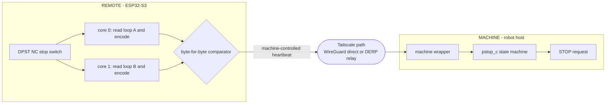
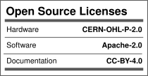

# Protective Stop


<a href="https://certification.oshwa.org/us002846.html">
  
</a>

Protective Stop is an open hardware remote for robots and automation. A
PoE- or USB-powered ESP32-S3 watches a physical stop switch and reports its
state to machine-side pstop logic. A STOP message, a wiring fault, or a lost
heartbeat causes the machine process to request STOP.

Each machine sets its own heartbeat window; the remote normally transmits
halfway through it. The network update rate is therefore configured, not fixed.

> This is a protective stop, not an emergency stop. It does not replace a
> required emergency-stop function, including hardwired power removal where
> applicable. OSHWA certification covers open source hardware; it is not
> functional-safety certification.

## How it works

The switch has two normally closed contacts, each wired to a separate GPIO loop
and read by one CPU core. Each core builds the full pstop message independently;
transmission occurs only when both encoded messages match exactly.

Pressing the switch opens both loops and sends STOP. A broken wire or other
fault in one loop makes the cores disagree, while a stalled task or loss of all
network paths prevents transmission. In either case, the machine requests STOP
when its silence timeout expires.

The wire protocol and machine-side state logic come from vendored
[`pstop_c`](pstop_c/), which remains unchanged and follows a separate
certification track. The surrounding firmware handles sensing, networking, and
recovery.


```mermaid
flowchart LR
    subgraph REMOTE["REMOTE - ESP32-S3"]
        SW["DPST NC stop switch"]
        C0["core 0: read loop A and encode"]
        C1["core 1: read loop B and encode"]
        CMP{"byte-for-byte comparator"}
        SW --> C0 --> CMP
        SW --> C1 --> CMP
    end

    NET(["Tailscale path<br/>WireGuard direct or DERP relay"])

    subgraph MACHINE["MACHINE - robot host"]
        APP["machine wrapper"]
        LIB["pstop_c state machine"]
        STOP["STOP request"]
        APP --> LIB --> STOP
    end

    CMP -->|"machine-controlled heartbeat"| NET --> APP
```

Peers addressed directly over LAN or USB-NCM bypass Tailscale and are not
WireGuard-encrypted. Tailscale peers use WireGuard, with DERP relay fallback
when a direct path is unavailable. Their sockets are pinned to the tunnel, so
losing the VPN causes silence instead of a plaintext downgrade. Ethernet is
preferred, with USB-NCM and WiFi available as fallbacks.

## What's included

| Path | Contents |
|---|---|
| [`hardware/`](hardware/) | Editable FreeCAD enclosure, printable files, BOM, wiring, and photographed assembly guide |
| [`firmware/`](firmware/) | ESP-IDF remote firmware and the dual-core sensing/comparison logic |
| [`host/`](host/) | Plain-C machine process and its documented configuration |
| [`ros2/`](ros2/) | ROS 2 machine node and messages |
| [`components/`](components/) | Embedded networking, USB tether, and `pstop_c` integration |
| [`docs/`](docs/) | API, recovery, testing, networking, and safety-case documentation |
| [`tools/`](tools/) and [`test/`](test/) | Protocol, chaos, soak, flashing, and static-analysis tools |

Tailscale support uses
[`microlink`](https://github.com/CamM2325/microlink), an embedded client from
Malone Technologies.

## Build and run

### Remote firmware

ESP-IDF 5.5 is required.

```sh
cp firmware/sdkconfig.credentials.example firmware/sdkconfig.credentials
$EDITOR firmware/sdkconfig.credentials
cd firmware
. /path/to/esp-idf-v5.5/export.sh
idf.py build
idf.py -p /dev/ttyACM0 flash
```

Later updates can be sent through the authenticated admin API:

```sh
curl -u 'admin:<password>' \
  --data-binary @build/pstop_remote.bin \
  'http://<remote>/admin/api/ota'
```

### Machine process

The host process needs only a C compiler and `make`:

```sh
cd host
make
./machine_app_runner machine.toml
```

Point the remote at that machine:

```sh
curl -X POST "http://<remote>/api/pstop_peer?ip=<machine-ip>&port=8890"
```

For USB operation, complete the one-time host setup in
[`docs/USB_NCM_SETUP.md`](docs/USB_NCM_SETUP.md). Hardware assembly starts with
the [`hardware/README.md`](hardware/README.md) and the photographed
[`hardware/ASSEMBLY.md`](hardware/ASSEMBLY.md) guide.

## Timing and arming

The network update rate and stop-on-silence time are machine-controlled:

```text
remote send interval = clamp(heartbeat_ms / 2, 100 ms, 1000 ms)
stop-on-silence time = heartbeat_ms * max_missed_heartbeats
```

The default configuration uses a 400 ms heartbeat window and five missed
windows, giving a send interval of about 200 ms and a stop-on-silence threshold
of about 2 seconds. Integrators should choose values within the validated limits
so the timeout fits their process safety time and network conditions.

The machine starts stopped. To arm it, press and hold the switch for at least
`min_stop_ms` (500 ms by default), then release it. Machine policy determines
which remotes may re-arm: the hardware and ROS 2 machine implementations default
to stop-only, while the included host configuration is permissive for bench use.

One remote can maintain independent sessions with up to four machines. Each
machine controls its own heartbeat window, timeout, and authorization policy.

## Testing

The repository includes host-side protocol tests, fault-injection and chaos
ladders, transport soaks, ROS 2 tests, firmware builds, and a MISRA C:2012
pre-check. Start with [`docs/TESTING.md`](docs/TESTING.md); long-run transport
testing is documented in
[`docs/CONNECTIVITY_SOAK.md`](docs/CONNECTIVITY_SOAK.md).

```sh
make -C host test
./tools/misra_check.sh
pre-commit run --all-files
```

## Certification and licensing

The Protective Stop v1.2 hardware design was OSHWA-certified as open source
hardware on August 27, 2026:

- OSHWA UID: **[US002846](https://certification.oshwa.org/us002846.html)**
- Hardware: CERN-OHL-P-2.0
- Software and firmware: Apache-2.0
- Documentation: CC-BY-4.0 unless a file states otherwise

<a href="https://oshwa.github.io/certification-mark-generator/facts">
  
</a>

The source package, licensing map, and mark guidance are summarized in
[`docs/OSHWA_COMPLIANCE.md`](docs/OSHWA_COMPLIANCE.md). Full license texts are
in [`LICENSE`](LICENSE) and [`LICENSES/`](LICENSES/).

The design target for the on-demand stop function is SIL 3 under IEC 61508 and
PL e under ISO 13849. These are engineering targets, not current
functional-safety certifications. The safety case and remaining evidence gaps
are tracked in [`docs/safety/`](docs/safety/) and
[`docs/safety/OPEN_ITEMS.md`](docs/safety/OPEN_ITEMS.md).

## Contributing

See [`CONTRIBUTING.md`](CONTRIBUTING.md) for development requirements. Report
security issues through [`SECURITY.md`](SECURITY.md).
