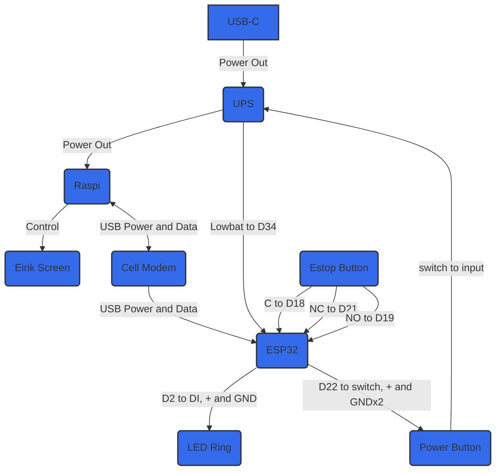

# Hardware

## Materials

- Raspberry Pi Zero 2 W ([Raspberry Pi](https://www.raspberrypi.com/products/raspberry-pi-zero-2-w/))
- UPS Expansion Board for Raspberry Pi Zero 2 W ([Geekworm](https://www.amazon.com/Geekworm-Raspberry-18650-Expansion-Include/dp/B0B74NT38D?crid=UGIXJZM2NYHC&dib=eyJ2IjoiMSJ9.V6PXTq4cQLVIoAyz09KVaIAl8ySs6ZIS8TBRidNcvihlwRl-d7pDErz_eZWv4Lsldi9GpmddtoKKDfj1u0NoywFJ0IWeWppmJl-0Qb4BeQMkhIRkqAdyQ8uXgPy85BtZELJuApe-PlkA8M5HghkH7DCDy_ubq-FIw7LKiNFAW7F53BXEbQQTWMrJnJcBzV5xHYbP61CvMpkz7lanul3r91J4oJVj-iEepft_hsg8Q0OfX15y7W6b3O1_d1r0Qn1zXOrOEM5yvxyKJ6-IspBueSYXne_Ta7GuNF5O0HE0yos.HevrvZqFXK2Z9E5b7bjkfmzNFk8LewbouiwTD7MREWs&dib_tag=se&keywords=raspberry+pi+zero+2+w+ups&qid=1711140841&s=electronics&sprefix=raspberry+pi+zero+2+w+ups,electronics,140&sr=1-3))
- Heatsink for Raspberry Pi Zero 2 W ([Geekworm](https://www.amazon.com/Geekworm-Raspberry-Heatsink-Aluminumn-Compatible/dp/B09QMBCXLB?dib=eyJ2IjoiMSJ9.73Nqb_yII8u4WocJEIjBR5mZ96yaxttTot1ZwNxyQePDVUkRbJd5mmvoQwNzPLRlde53dXWK6y4-EQHYIb9mbWP0gld_27GesIkdcueH2SaMP_RW_NOkx_rONWBRbQjMkSFW6O7UtrkHXb8GNNIIbmiM9UnSPyiw_e1G_8NGL_s1bryc1JnHdpF4CLn7v-eWxGFI1UKh3CSnwBYKDQSniC1OidtFbhKX5O2xMZ6Phic.z8w5xcGB54LRetlOZSo0E61cZRjoHTQKEFjIgxnD390&dib_tag=se&keywords=raspberry+pi+zero+heatsink&qid=1711140710&sr=8-3))
- E-ink display ([Waveshare](https://www.amazon.com/2-13inch-Display-HAT-Two-Color-Raspberry/dp/B07Z1WYRQH?crid=2N4PGV1FBY4F5&dib=eyJ2IjoiMSJ9.UQEWmdUnozuDD5-a74CTPvct9uM3NC_-VgXh1e3r4xzUgEYLpkssOkhlFvdhd-gRIDqoiaC207o0qHzdA8hx93xDthrPbbOnmX2bu-ASd6KpUtQuiB6QXAIdk6SM9XmVlFn4KzoMtwZoZBmlTUaeFKQrrObE_o1vHcoZe2aZ0jblSUWh0OJqxSo741TFpBhtf_2V1-AznsDsXS4PVVjvZAVs3a-jgqYWeEvY-BFPKbs.SWoiafx25u_nlhzkcTWvvN9sabofjKdxpM2jALE1qRs&dib_tag=se&keywords=e-ink+display&qid=1711144463&sprefix=e-ink,aps,152&sr=8-5))
- Cell modem SIM7600X 4G HAT
- Push button ([uxcell](https://www.amazon.com/dp/B07Z2TY2SZ))
- ESP32
- Electrical wire ([Fermerry 28 AWG](https://www.fermerry.com/products/fermerry-28-awg-stranded-wire-silicone-cables-hook-up-wire-kit-6-colors-5ft-each-28-gauge-electrical-wire))
- E-Stop Button
- Electric tape
- 40-GPIO header ([Vilros](https://www.amazon.com/Vilros-Solderless-Hammer-Header-Raspberry/dp/B09XVPYYTX?crid=1079SOXYDAH2S&dib=eyJ2IjoiMSJ9.-laHwzIta4vS0VS7fb8li0n-BLoZIwyBzFnsCPb7OHX_Y6TaTyO4xorLdMRKyKk8ZQFSN4IhfMsUJtpAq3eikw3L5WI2iXvTzUDdcre3mmhXI18_bNH9vLFMCG_bZWbWv6LAklPOLvIgDmeBzHK9v0vGEjA6e_l8DEjec6UjVbVRWdBN2GrXeqwdMVmU6po3Be4R6oBtL2SZrK_JrUn1k_f4ASSZklNUtCgdEB2DbyY.GwAU5oc6JI4_KNF6qZq_uoV5kQAE3hTXbI_I8KuyViY&dib_tag=se&keywords=gpio&qid=1711574183&sprefix=gpio,aps,160&sr=8-2))
- Cell modem SIM7600X 4G HAT
- microUSB to microUSB cable
- microUSB to USB cable

## Assembly Instructions
### Preliminary Steps
1. Tape over Raspberry Pi USB connections

  

2. Solder Raspberry Pi GPIO pin extender
- Use flux to make soldering easier
- Secure a few pins on each end first for better stability
- May want to clean singe marks from flux after soldering; we used a toothbrush and water for this.

   <i> Left = before, right = after </i>

3. Apply Raspberry Pi heat sink.
- The Geekworm heatsink we used came with two thermal pads, one is 0.5mm and the other is 1mm. Make sure each pad goes in the right place! It comes with a diagram.

    <i> Before </i>

    <i> After </i>

- Screw on the heatsink to the Raspberry Pi, and through to the UPS.

    <i> Thermal Pad Placement </i>

4. Add e-ink display to UPS using GPIO header.

    <i> Top to bottom: UPS, GPIO header, e-ink display </i>

    <i> Add header to underside of e-ink </i>

    <i> Install e-ink to UPS by plugging in GPIO header to pins </i>

## Wiring
Now it’s time to starting connecting stuff together. The connections at a glance are shown below.

### Wire Soldering
We will go through the wire soldering connections in the diagram above one by one. The color of the wires does not actually matter, but they are referred to throughout these instructions to enhance clarity.

1. Stop Button to ESP32
- Stop Button C → ESP32 D18 (Blue wire)
- Stop Button NO → ESP32 D19 (Yellow wire)
- Stop Button NC → ESP32 D21 (White wire)
- Don't forget to put O-ring on E-stop button!

    <i> Stop button wiring </i>

    <i> Corresponding ESP32 wiring for stop button </i>

2. LED Ring to ESP32
- LED Ring DI → ESP32 D2 (Green wire)
- LED Ring PWR5V → ESP32 VIN (Red wire)
- LED Ring GND → ESP32 GND (Black wire)

    <i> LED ring wiring </i>

    <i> Corresponding ESP32 wiring for LED ring </i>

3. Power Button to ESP32 and UPS
- Power Button LED power terminal  → ESP32 D22 and UPS pin 3 (White wires)
- Power Button LED ground and switch contact A → ESP32 GND (Black wire)
- Power Button switch contact B→ ESP32 D23 (Red wire)
- Don’t forget to put O-ring on power button!

    <i> Color of oval corresponds color of wire to connect to terminal. </i>

    <i> Corresponding ESP32 wiring for LED ring </i>

    <i> White wire soldered to UPS </i>

    <i> Diagram of UPS </i>

    <i> Black, white, and red wires soldered to ESP32 </i>

