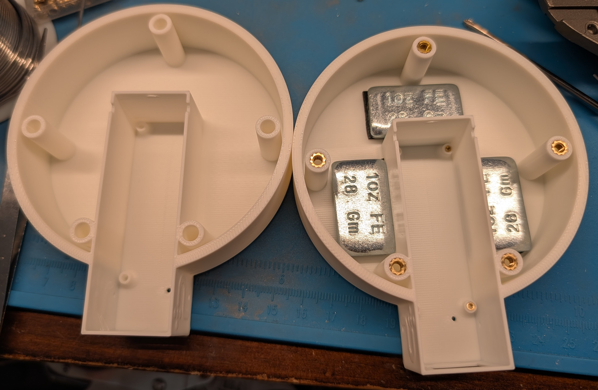
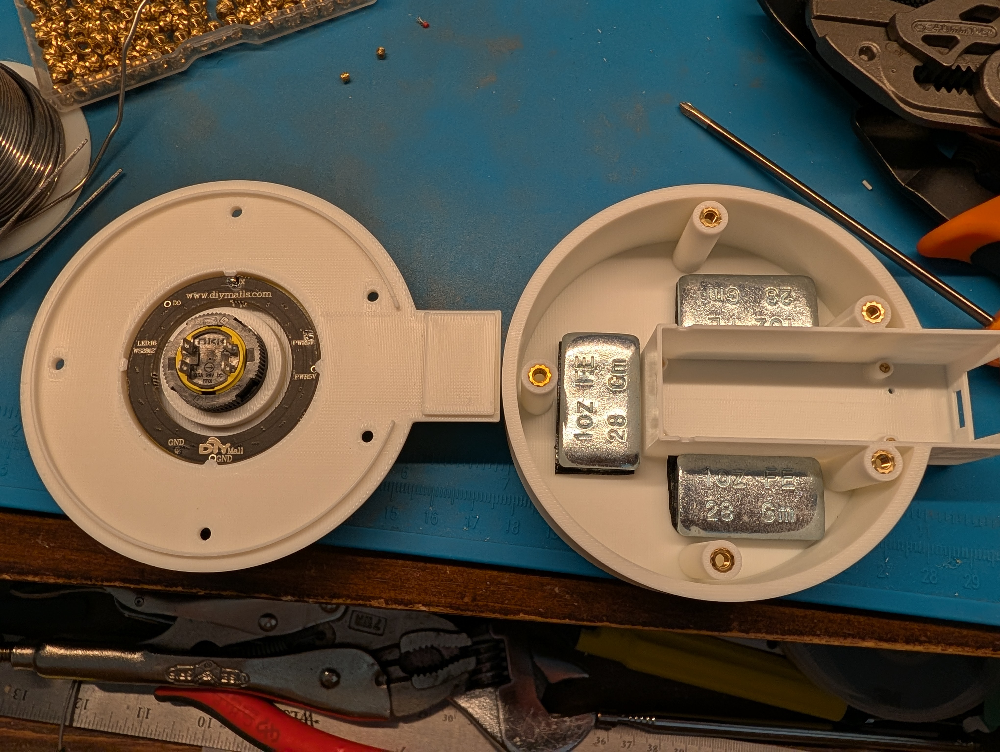
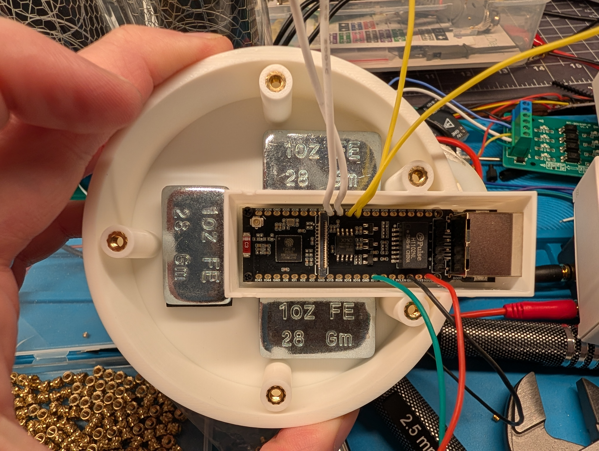
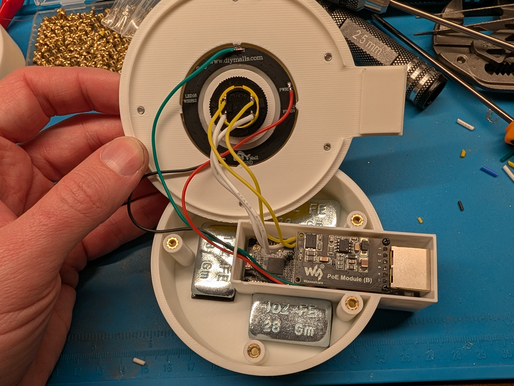
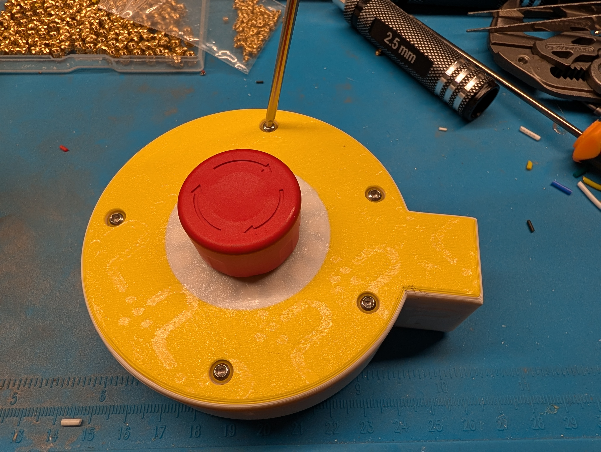

# Assembly guide

Building one Protective Stop remote takes about 15 minutes. Order the
parts from the [BOM](README.md#bill-of-materials) and print the enclosure
(`print.3mf`) first; the white diffuser is part of the lid print, not a
separate piece. Wire colors and pin names follow the
[wiring table](README.md#pinout-and-wiring).

Tools: soldering iron (wiring and heat-set inserts), solder, flush
cutters, wire stripper, Phillips screwdriver, 2.5 mm hex driver.

## 1. Prepare the base

Press the brass heat-set inserts into the base with the soldering iron:
M3 inserts into the lid-screw bosses, M1.6 inserts into the board anchor
holes in the side pod. Stick the three 1 oz steel weights into the floor
pockets. The weights are ballast so the unit stays put on a table instead
of following the Ethernet cable around.

## 2. Mount the button and ring in the lid

Push the E-stop button through the center hole from the top and lock it
with its collar from below. Seat the LED ring around the button body,
LEDs facing the diffuser. Rotation does not matter electrically, since
which pixel counts as LED 1 is calibrated over the network after
assembly; for consistency across units, match the orientation in the
photo.

## 3. Solder the board wires and seat the board

Solder the wires to the board pads first, leaving enough slack to open
the lid comfortably:

| Wire | Board pad |
|---|---|
| red | VBUS |
| black | GND |
| green | IO17 |
| white x2 | IO39, IO40 |
| yellow x2 | IO41, IO42 |

Then drop the board into the pod channel, connectors facing out, and
anchor it with the short M1.6 Phillips screws.

## 4. Install the PoE module and wire the lid

Set the PoE Module (B) onto the board and fasten it with the longer
Phillips screws that come with the ESP32-S3-ETH; every unit gets the
module. Thread the three ring wires (red, black, green) through the
routing hole, then solder the connections: red to PWR5V, black to GND,
green to DI (the ring has two PWR5V and two GND pads; either works, but
mind the DI/DO marking, since data only enters at DI). The white pair
goes to button terminals 11 and 12, the yellow pair to 21 and 22; within
a pair, either wire on either terminal.

## 5. Close the lid

Fold the wires into the base so the lid does not pinch them, seat the
lid, and drive the M3 screws into the inserts with the 2.5 mm hex driver.
Snug is enough; the inserts strip before the screws do.

## 6. Commission

Connect USB and flash; a fresh board enters download mode on its own.
(If automatic flashing does not work, hold BOOT and tap RST to force
download mode.) Everything after the first flash goes over the network.
See the [quickstart](../README.md#quickstart) for the flash and
machine-pairing steps, then calibrate the ring rotation:
`POST /api/ring_led1?on=1` lights the pixel the firmware currently calls
LED 1, and `POST /api/ring_offset?n=0..15` moves it to where the bezel
says LED 1 should be ([API reference](../docs/API.md)).
