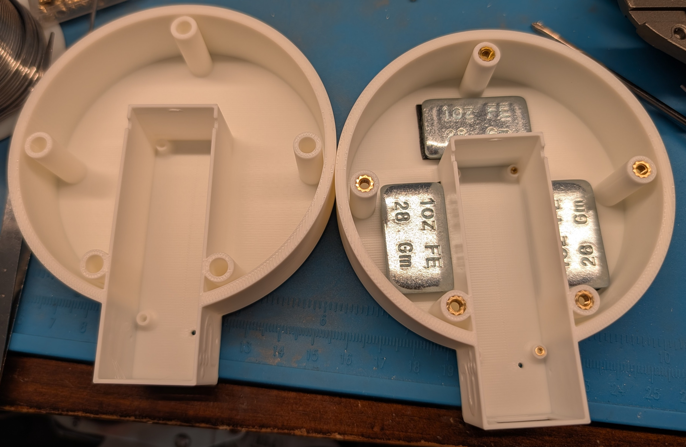
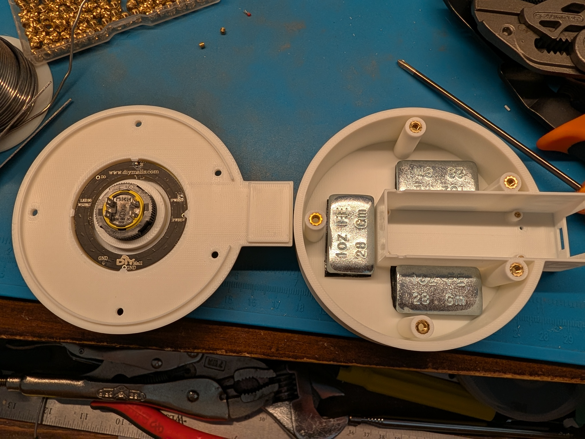
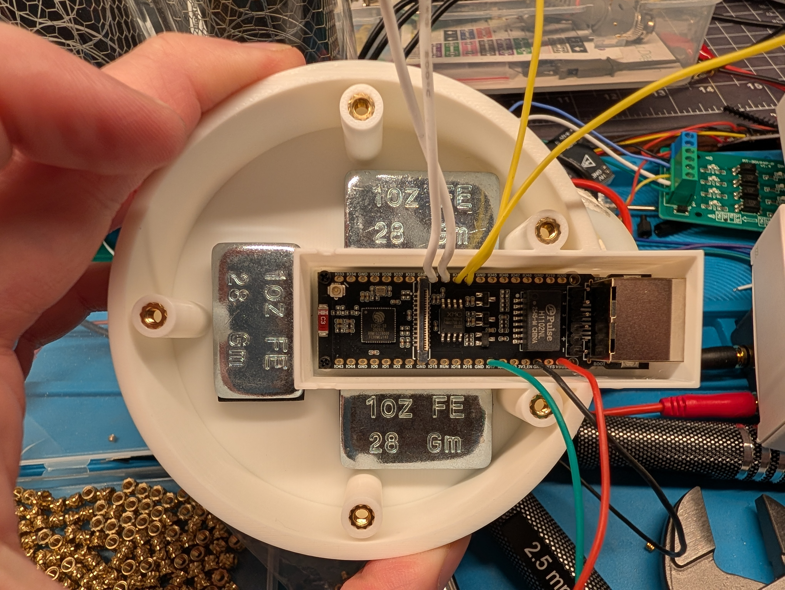
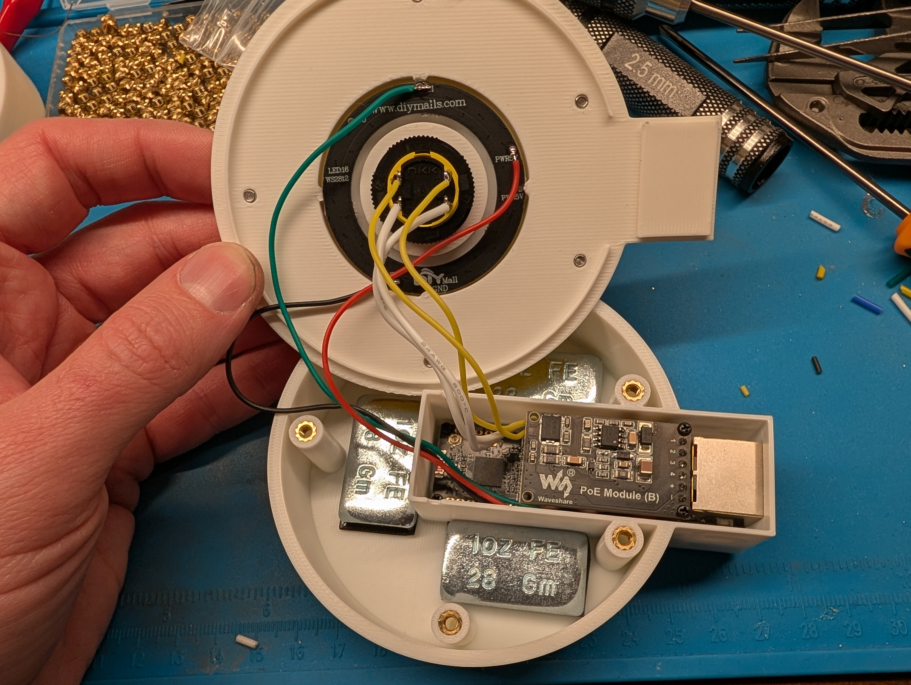
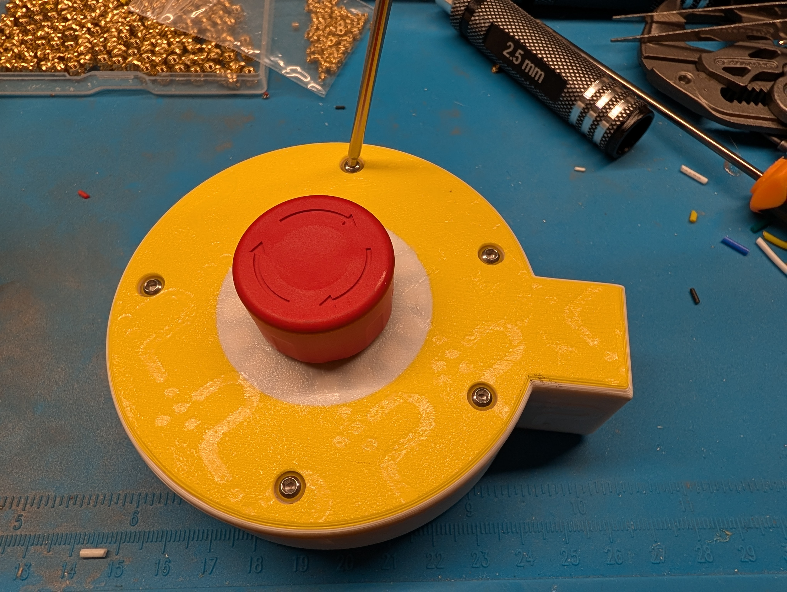
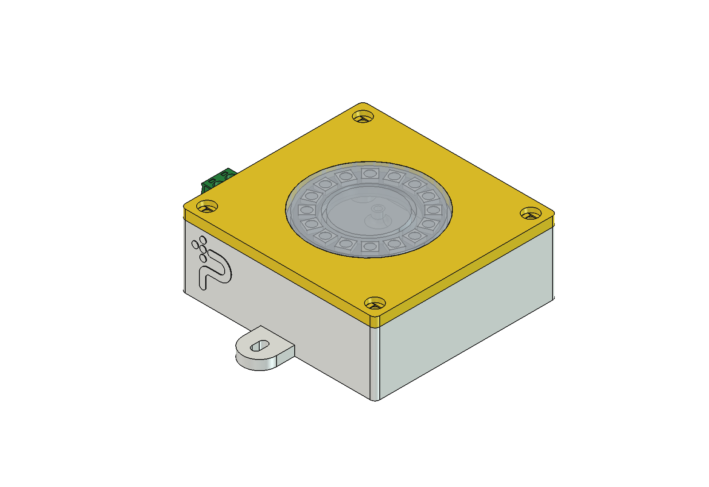
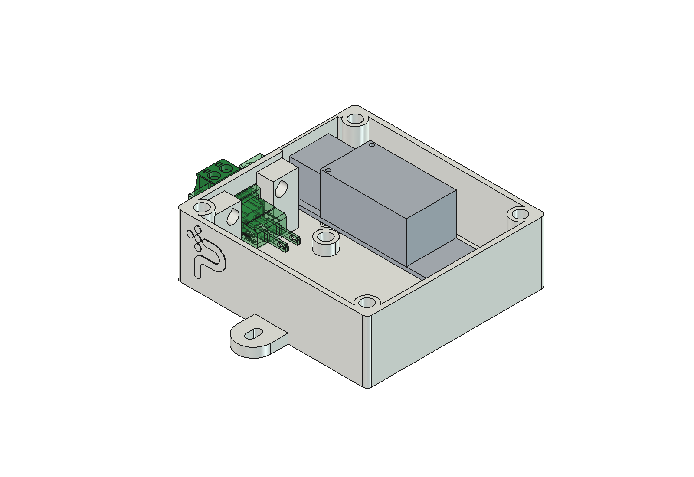

# Assembly guide

Building one Protective Stop remote takes about 15 minutes. Order the
parts from the [BOM](README.md#bill-of-materials) and print the enclosure
(`print.3mf`) first; the white diffuser is part of the lid print, not a
separate piece. Wire colors and pin names follow the
[wiring table](README.md#pinout-and-wiring).

Tools: soldering iron (wiring and heat-set inserts), solder, flush
cutters, wire stripper, Phillips screwdriver, 2.5 mm hex driver.

## Printing the enclosure

`print.3mf` is a Bambu Studio project with everything preconfigured; the
plate holds two units (two bases, two lids). The reference setup, straight
from the project file:

- Printer: Bambu Lab X1 Carbon, 0.4 mm nozzle, textured PEI plate.
- Process: the 0.20 mm Strength preset, tuned to 6 walls, 25% grid
  infill, 5 top / 3 bottom shells.
- Filaments: AMS slot 1 is white Bambu PLA Tough+ (base, diffuser,
  supports), slot 2 is yellow PLA Tough+ (lid face). The lid is the
  two-color piece; it prints face-down, so the yellow only appears in
  the first few layers and the AMS swaps are cheap. The diffuser prints
  in the white as part of the lid.
- Tree supports (auto) and auto brim are on; leave them enabled, since
  the side pod overhangs need the support.
- Sliced on this setup, the full plate runs about 4.5 hours and uses
  144 g of filament (136 g white, 9 g yellow) for the two units.
  `print.gcode.3mf` is that exact sliced plate, ready to send to an
  X1C.

Other printers and materials work; keep the walls and infill at least
this heavy, because the lid takes the button's shove every time someone
hits STOP.

## 1. Prepare the base

Press the brass heat-set inserts into the base with the soldering iron:
M3 inserts into the lid-screw bosses, M1.6 inserts into the board anchor
holes in the side pod. Optionally, stick the three 1 oz steel weights
into the floor pockets; they are ballast so the unit stays put on a table
instead of following the Ethernet cable around.

## 2. Mount the button and ring in the lid

Push the E-stop button through the center hole from the top and lock it
with its collar from below. Seat the LED ring around the button body,
LEDs facing the diffuser. Rotation does not matter electrically, since
which pixel counts as LED 1 is calibrated over the network after
assembly; for consistency across units, match the orientation in the
photo.

## 3. Solder the board wires and seat the board

Solder the wires to the board pads first, leaving enough slack to open
the lid comfortably:

| Wire | Board pad |
|---|---|
| red | VBUS |
| black | GND |
| green | IO17 |
| white x2 | IO39, IO40 |
| yellow x2 | IO41, IO42 |

Then drop the board into the pod channel, connectors facing out, and
anchor it with the short M1.6 Phillips screws.

## 4. Install the PoE module and wire the lid

Set the PoE Module (B) onto the board and fasten it with the longer
Phillips screws that come with the ESP32-S3-ETH; every unit gets the
module. Thread the three ring wires (red, black, green) through the
routing hole, then solder the connections: red to PWR5V, black to GND,
green to DI (the ring has two PWR5V and two GND pads; either works, but
mind the DI/DO marking, since data only enters at DI). The white pair
goes to button terminals 11 and 12, the yellow pair to 21 and 22; within
a pair, either wire on either terminal.

## 5. Close the lid

Fold the wires into the base so the lid does not pinch them, seat the
lid, and drive the M3 screws into the inserts with the 2.5 mm hex driver.
Snug is enough; the inserts strip before the screws do.

## 6. Commission

Connect USB and flash; a fresh board enters download mode on its own.
(If automatic flashing does not work, hold BOOT and tap RST to force
download mode.) Everything after the first flash goes over the network.
See the [quickstart](../docs/QUICKSTART.md) for the flash and
machine-pairing steps, then calibrate the ring rotation:
`POST /api/ring_led1?on=1` lights the pixel the firmware currently calls
LED 1, and `POST /api/ring_offset?n=0..15` moves it to where the bezel
says LED 1 should be ([API reference](../docs/API.md)).

# Machine side (relay box)

  
  

The machine box mounts on the robot and runs the `machn` firmware
([design](../docs/MACHINE_ESP32_DESIGN.md)). It uses the same ESP32-S3-ETH
board as the remote and drives two relays whose contacts are wired **in
series** in the robot's stop circuit: each core drives one relay, so either
core alone can stop the robot. The stop circuit leaves the box through a
pluggable Phoenix terminal block. The enclosure source is
`machine-casing.FCStd`; it also contains the Phoenix header and plug models
as fit references.

## Parts

| Qty | Part | Notes |
|---|---|---|
| 1 | Waveshare ESP32-S3-ETH + PoE Module (B) | Same board as the remote. |
| 1 | 2-channel 5 V relay module, **active-high input** | 50 x 39 mm board, M3 holes on a 44.86 x 33.57 mm pattern (the common SRD-05VDC layout). The coil must be energized when IN is HIGH: pick a module with a high/low trigger jumper and set it to H. See the fail-safe note below. |
| 1 | Phoenix Contact DFK-MSTB 2,5/2-GF-5,08 (0710170) | 2-pin through-wall header with screw flange. |
| 1 | Phoenix Contact MSTB 2,5/2-STF-5,08 (1777989) | Mating plug with locking screws; takes the robot's stop-circuit wires. |
| 10 | M3 heat-set inserts | 4 lid bosses, 4 relay standoffs, 2 connector bosses. The relay standoff bores are 4.5 mm deep, so use inserts no longer than 4.5 mm there. |
| 4 | M3 x 8 socket-head screws | Lid. |
| 4 | M3 x 6 screws | Relay module. |
| 2 | M3 x 12 socket-head screws | Connector flange, from the front into the inserts. |
| 2 | M3 screws, length to suit | Mounting ears (4 mm thick, M3 slots with 3 mm of travel). |
| 4 | M1.6 heat-set inserts + short M1.6 screws | ESP32 board, same as the remote. |
| 1 set | Hookup wire | Signal wires as for the remote; the stop-circuit wires sized for the robot's stop circuit. |
| 1 | DIYmall WS2812B ring, 16 pixels | Same ring as the remote; shows the machine's state (see step 6). |

## Printing

Print `machine-base.stl` floor-down and the lid face-down, like the remote:
`machine-lid-minus-led.stl` in yellow and `machine-led.stl` (the diffuser) in
white as two parts of one object, or `machine-lid.stl` in a single colour.
Neither part needs supports. The only overhangs are the tops of the RJ45,
USB-C and connector openings, which bridge across the wall, and the lid
counterbores, which have bridging layers built in. If your slicer still adds
supports, keep them to tree supports from the build plate only.

## 1. Prepare the base

Press the heat-set inserts in with the soldering iron: M3 into the four
corner columns, the four relay standoffs and the two connector bosses behind
the port wall (press these from inside the box, toward the wall), and M1.6
into the four ESP32 posts.

## 2. Fit the connector

Push the Phoenix header into the opening in the port wall from outside, so
its latch lugs drop into the pockets behind the wall and the flange sits flat
on the outside. Drive the two M3 x 12 screws from the front through the
header's flange into the inserts. Snug is enough.

## 3. Wire and mount the relay module

Use the **normally open (NO)** contacts only, and wire the two relays in
series between the header pins:

| From | To |
|---|---|
| Header pin 1 | Relay 1 COM |
| Relay 1 NO | Relay 2 COM |
| Relay 2 NO | Header pin 2 |

The header pins reach about 5 mm over the input end of the relay module,
above its circuit board, so solder the wires to the pins (or use
low-profile 2.8 mm receptacles) and route them clear of the module's input
pins. Then screw the module onto its standoffs with the M3 x 6 screws,
input header toward the connector. Leave
the JD-VCC jumper fitted so the coils run from the board's 5 V.

> **Fail-safe rule.** The robot may only run while **both coils are
> energized**. The firmware drives IO39 and IO41 HIGH to energize and holds
> them LOW (pull-down) at boot, in reset and on STOP. With an active-high
> module on NO contacts, every failure (box power loss, ESP32 reset, a
> broken signal wire, a failed core) opens the circuit. Do **not** use an
> active-low module (IN low = relay on, typical of modules without a trigger
> jumper) and do **not** compensate by moving to the NC contacts: the relays
> would then close the stop circuit whenever the box loses power or an IN
> wire breaks.

## 4. Solder the board wires and seat the board

| Wire | Board pad | Goes to |
|---|---|---|
| red | VBUS | Relay module VCC |
| black | GND | Relay module GND |
| white | IO39 | Relay module IN1 (core 0, relay 1) |
| yellow | IO41 | Relay module IN2 (core 1, relay 2) |

The LED ring is wired exactly as on the remote, through the lid:

| Wire | Board pad | Goes to |
|---|---|---|
| red | VBUS | Ring PWR5V |
| black | GND | Ring GND |
| green | IO17 | Ring DI |

IO40 and IO42 stay free: relay feedback is compiled out in the current
firmware (`CONFIG_MACHN_RELAY_FEEDBACK`, see
[RELAY_FEEDBACK_DESCOPE](../docs/RELAY_FEEDBACK_DESCOPE.md)).

Drop the board into its cradle with the RJ45 and USB-C through the port
wall, anchor it with the M1.6 screws, and fit the PoE module.

## 5. Check the relays fail safe

Before the box goes anywhere near a robot, put a continuity meter across the
two terminals of the Phoenix plug (plugged into the header) and check every
row. Flash the `machn` firmware first (`cd machn && idf.py build flash`,
ESP-IDF v5.5).

| Condition | Expected |
|---|---|
| Box unpowered | open |
| Powered, holding the board's RESET button | open |
| Powered and booted, not armed | open |
| Armed from a paired remote | closed |
| STOP pressed on the remote | open |
| Armed, then IN1 wire unplugged | open |
| Armed, then IN2 wire unplugged | open |

If any row reads closed where it should read open, stop: the module is
active-low or the wiring uses NC contacts.

## 6. Close and mount

Seat the ring in the diffuser pocket in the lid, LEDs facing the diffuser.
Fold the wires in, seat the lid and drive the four M3 x 8 screws. Mount the
box through the two ears with M3 screws; the slots give 3 mm of adjustment.

The ring shows the machine's state the same way the remote's ring does, so
both agree: one segment per remote assigned to this machine (allowlisted or
pinned remotes, plus any remote it has served since boot), coloured by the
last reply the machine sent it. Dim white means no remote is assigned; amber
blinks mean an assigned remote is not reachable (1 blink = the remote is
silent, 2 = Tailscale is down, 3 = no Internet); blue is bonding, green is
cleared to run and red is STOP. Purple across the whole ring means the two
cores disagree. As on the remote, calibrate which pixel is LED 1 with
`POST /api/ring_led1?on=1` and `POST /api/ring_offset?n=0..15`.

## 7. Connect the stop circuit

Wire the robot's stop circuit through the Phoenix plug so both relays sit in
series in the loop, plug it into the header and tighten the plug's two
locking screws. The header is rated 12 A / 320 V; the relays and the robot's
stop-circuit rating set the real limit, so check both against the loop you
are switching.
