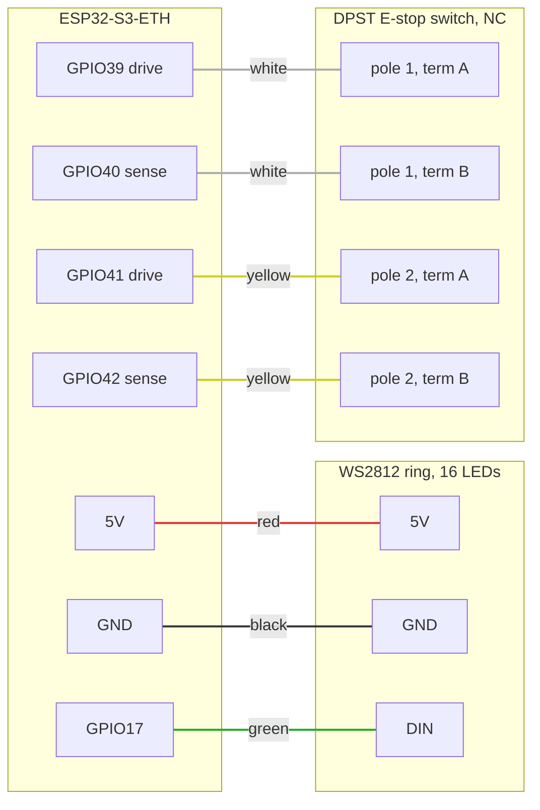

# Hardware (WIP)

  
  

The physical design of the Protective Stop remote lives here: enclosure CAD
(FreeCAD source `casing.FCStd` plus printable exports), the Waveshare
ESP32-S3-ETH carrier board (`ESP32-S3-ETH-Schematic.pdf`, photos, STEP), and
the LED and connector models. CAD render on the left, a printed unit on the
right: the E-stop button sits in the center, the LED ring lights the
diffuser around its base, and the Ethernet and USB-C ports live in the
side pod.

## Pinout and wiring

Two external parts connect to the board: the 16-LED WS2812 ring and a DPST
normally-closed E-stop switch. Each pole of the switch sits in its own
loopback: the firmware drives one GPIO and reads the echo on another, once
per pole, so a broken wire reads the same as a pressed button (STOP). The
GPIO assignments are fixed in the firmware; the wire colors are only an
assembly convention to keep units consistent and easy to check.

| Board pin | Goes to | Wire color |
|---|---|---|
| 5V | Ring 5V | red |
| GND | Ring GND | black |
| GPIO17 | Ring DIN (data) | green |
| GPIO39 | Switch pole 1, terminal A | white |
| GPIO40 | Switch pole 1, terminal B | white |
| GPIO41 | Switch pole 2, terminal A | yellow |
| GPIO42 | Switch pole 2, terminal B | yellow |

Notes:

- The switch poles have no polarity; either terminal of a pole can go to
  the drive pin. Keep each color pair on one pole.
- The sense pins are pulled down internally, so an open loop reads 0 and
  the firmware treats it as STOP. Pressing the button opens both poles at
  once; a single open loop (one broken wire) makes the two cores disagree,
  which also stops the machine.
- The ring can be installed in any of its 16 rotations. Which pixel counts
  as LED 1 is a per-device setting, calibrated over the network after
  assembly (`POST /api/ring_offset`, see `../docs/API.md`).
- The board's onboard status LED (GPIO21) needs no wiring.

## Bill of materials

Everything except the printed parts is ordered online. Pinned listings
where we have them; the rest are search links, and the specs in the notes
are what matters either way. All links open in a new window.

| Qty | Part | Notes | Order |
|---|---|---|---|
| 1 | Waveshare ESP32-S3-ETH | The W5500 Ethernet carrier board this design is built around. The PoE variant powers the unit over the Ethernet cable. | <a href="https://www.amazon.com/s?k=waveshare+esp32-s3-eth" target="_blank" rel="noopener">search</a> |
| 1 | DIYmall WS2812B ring, 16 pixels | 5V addressable ring. | <a href="https://www.amazon.com/DIYmall-WS2812B-Integrated-Individually-Addressable/dp/B0B2D5QXG5" target="_blank" rel="noopener">Amazon</a> |
| 1 | NKK Switches FF0126BBCAEA01 E-stop button | Twist-release mushroom, two normally-closed contacts (DPST NC). The STEP model in this folder is this exact part. Substitutes must have 2NC: both loops need an NC pole, so a 1NO+1NC unit will not work. | <a href="https://octopart.com/part/nkk-switches/FF0126BBCAEA01" target="_blank" rel="noopener">Octopart</a> |
| 1 set | Silicone hookup wire | Red, black, green, white, yellow, 24 to 26 AWG, per the wiring table above. | <a href="https://www.amazon.com/s?k=silicone+hookup+wire+kit+26awg" target="_blank" rel="noopener">search</a> |
| ~6 | M3 socket-head screws + brass heat-set inserts | Lid fasteners. Confirm length and count against the current print before buying in bulk. | <a href="https://www.amazon.com/s?k=m3+heat+set+insert+socket+head+kit" target="_blank" rel="noopener">search</a> |
| 4 | M1.6 heat-set threaded inserts, M1.6 x 5 x 2.5 mm | Anchor the ESP32-S3-ETH board to the base; 2.5 mm is the insert height/depth. | <a href="https://www.amazon.com/s?k=m1.6+heat+set+threaded+insert" target="_blank" rel="noopener">search</a> |
| 1 | Printed enclosure | `print.3mf` in this folder (base, lid, diffuser). Not purchased; any common PLA/PETG works. | n/a |

## Status: work in progress

These files are the current working set, not a finished, reproducible
design package. Some parts exist only as STL/STEP exports rather than
editable source, and there is no assembly guide yet. Still to do:

- editable source for every custom part,
- pinned product listings and verified quantities in the BOM,
- assembly instructions,
- per-file licensing.

OSHWA certification progress is tracked in
[`../docs/OSHWA_COMPLIANCE.md`](../docs/OSHWA_COMPLIANCE.md).
