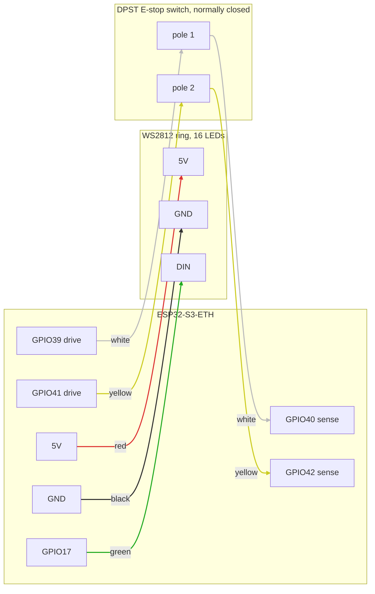

# Hardware (WIP)

The physical design of the Protective Stop remote lives here: enclosure CAD
(FreeCAD source `casing.FCStd` plus printable exports), the Waveshare
ESP32-S3-ETH carrier board (`ESP32-S3-ETH-Schematic.pdf`, photos, STEP), and
the LED, lens, and connector models.

## Pinout and wiring

Two external parts connect to the board: the 16-LED WS2812 ring and a DPST
normally-closed E-stop switch. Each pole of the switch sits in its own
loopback: the firmware drives one GPIO and reads the echo on another, once
per pole, so a broken wire reads the same as a pressed button (STOP). Match
the wire colors below when building a unit; the firmware and docs assume
them.

| Board pin | Goes to | Wire color |
|---|---|---|
| 5V | Ring 5V | red |
| GND | Ring GND | black |
| GPIO17 | Ring DIN (data) | green |
| GPIO39 | Switch pole 1, terminal A | white |
| GPIO40 | Switch pole 1, terminal B | white |
| GPIO41 | Switch pole 2, terminal A | yellow |
| GPIO42 | Switch pole 2, terminal B | yellow |

Notes:

- The switch poles have no polarity; either terminal of a pole can go to
  the drive pin. Keep each color pair on one pole.
- The sense pins are pulled down internally, so an open loop reads 0 and
  the firmware treats it as STOP. Pressing the button opens both poles at
  once; a single open loop (one broken wire) makes the two cores disagree,
  which also stops the machine.
- The ring can be installed in any of its 16 rotations. Which pixel counts
  as LED 1 is a per-device setting, calibrated over the network after
  assembly (`POST /api/ring_offset`, see `../docs/API.md`).
- The board's onboard status LED (GPIO21) needs no wiring.

## Status: work in progress

These files are the current working set, not a finished, reproducible
design package. Some parts exist only as STL/STEP exports rather than
editable source, and there is no BOM or assembly guide yet. Still to do:

- editable source for every custom part,
- a bill of materials with quantities and sources,
- assembly instructions,
- per-file licensing.

OSHWA certification progress is tracked in
[`../docs/OSHWA_COMPLIANCE.md`](../docs/OSHWA_COMPLIANCE.md).
