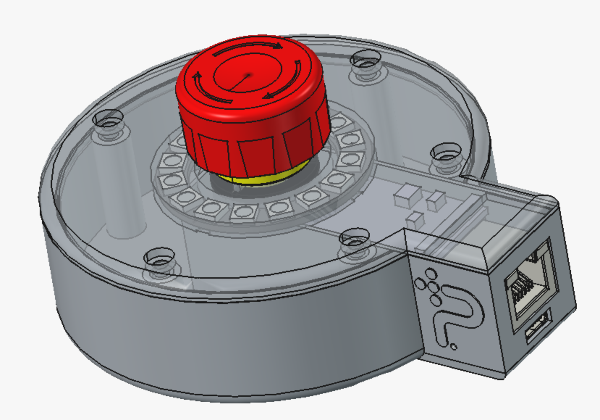
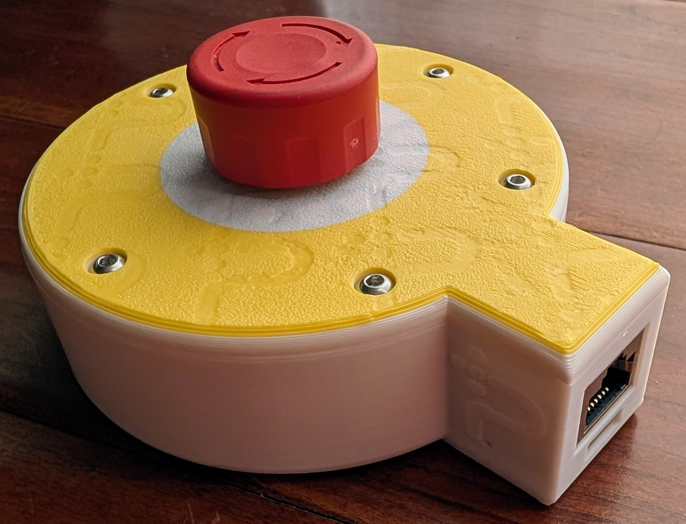
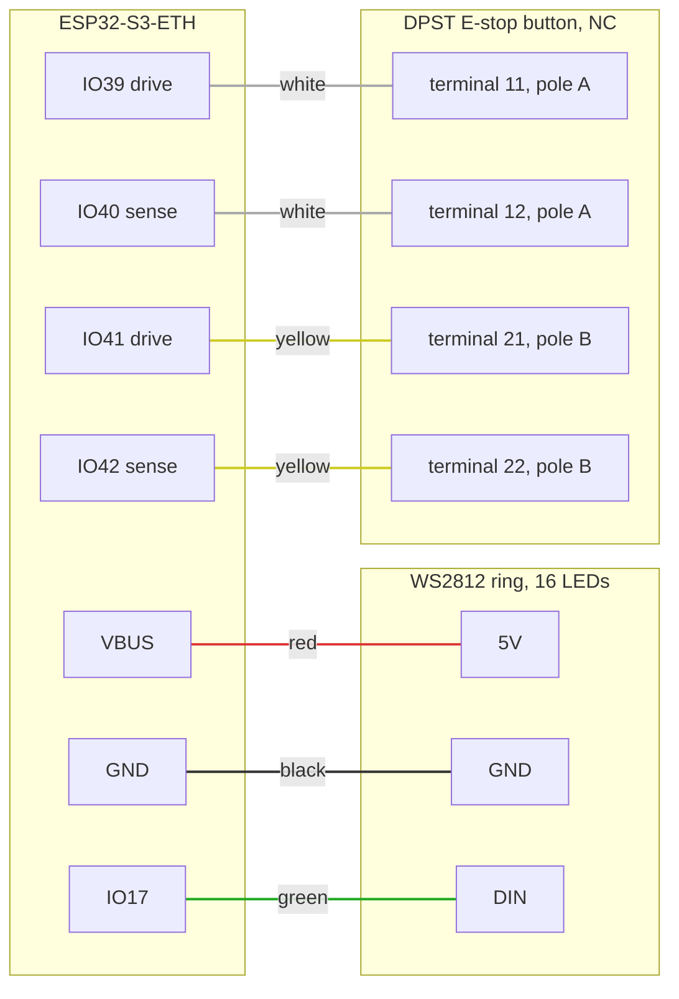

# Hardware (WIP)

  
  

The physical design of the Protective Stop remote lives here: enclosure CAD
(FreeCAD source `casing.FCStd` plus printable exports), the Waveshare
ESP32-S3-ETH carrier board (`ESP32-S3-ETH-Schematic.pdf`, photos, STEP), and
the LED and connector models. CAD render on the left, a printed unit on the
right: the E-stop button sits in the center, the LED ring lights the
diffuser around its base, and the Ethernet and USB-C ports live in the
side pod.

Build steps with photos: [ASSEMBLY.md](ASSEMBLY.md).

## Pinout and wiring

Two external parts connect to the board: the 16-LED WS2812 ring and a DPST
normally-closed E-stop button. Each pole of the button sits in its own
loopback: the firmware drives one GPIO and reads the echo on another, once
per pole, so a broken wire reads the same as a pressed button (STOP). The
pin assignments are fixed in the firmware; the wire colors are only an
assembly convention to keep units consistent and easy to check. Pin names
match the board silkscreen (IO17, IO39, and so on).

| Board pin | Goes to | Wire color |
|---|---|---|
| VBUS | Ring 5V | red |
| GND | Ring GND | black |
| IO17 | Ring DIN (data) | green |
| IO39 | Button terminal 11 (pole A) | white |
| IO40 | Button terminal 12 (pole A) | white |
| IO41 | Button terminal 21 (pole B) | yellow |
| IO42 | Button terminal 22 (pole B) | yellow |

Notes:

- The button contacts have no polarity; within a pole, either terminal can
  go to the drive pin. Keep each color pair on one pole: 11/12 together
  (white), 21/22 together (yellow).
- The sense pins are pulled down internally, so an open loop reads 0 and
  the firmware treats it as STOP. Pressing the button opens both poles at
  once; a single open loop (one broken wire) makes the two cores disagree,
  which also stops the machine.
- The ring can be installed in any of its 16 rotations. Which pixel counts
  as LED 1 is a per-device setting, calibrated over the network after
  assembly (`POST /api/ring_offset`, see `../docs/API.md`).
- The board's onboard status LED (IO21) needs no wiring.

## Bill of materials

Everything except the printed parts is ordered online. Listings are
pinned where the exact part matters; the wire and lid hardware are
generic, so those stay as search links. All links open in a new window.

| Qty | Part | Notes | Order |
|---|---|---|---|
| 1 | Waveshare ESP32-S3-ETH | The W5500 Ethernet carrier board this design is built around. For PoE-powered units order the ESP32-S3-POE-ETH variant on the same page; it includes the PoE Module (B) that mounts on the board. | <a href="https://www.waveshare.com/esp32-s3-eth.htm" target="_blank" rel="noopener">Waveshare</a> |
| 1 | DIYmall WS2812B ring, 16 pixels | 5V addressable ring. | <a href="https://www.amazon.com/DIYmall-WS2812B-Integrated-Individually-Addressable/dp/B0B2D5QXG5" target="_blank" rel="noopener">Amazon</a> |
| 1 | NKK Switches FF0126BBCAEA01 E-stop button | Twist-release mushroom, two normally-closed contacts (DPST NC). The STEP model in this folder is this exact part. Substitutes must have 2NC: both loops need an NC pole, so a 1NO+1NC unit will not work. | <a href="https://octopart.com/part/nkk-switches/FF0126BBCAEA01" target="_blank" rel="noopener">Octopart</a> |
| 1 set | Silicone hookup wire | Red, black, green, white, yellow, 24 to 26 AWG, per the wiring table above. | <a href="https://www.amazon.com/s?k=silicone+hookup+wire+kit+26awg" target="_blank" rel="noopener">search</a> |
| ~6 | M3 socket-head screws + brass heat-set inserts | Lid fasteners. Confirm length and count against the current print before buying in bulk. | <a href="https://www.amazon.com/s?k=m3+heat+set+insert+socket+head+kit" target="_blank" rel="noopener">search</a> |
| 4 | M1.6 heat-set threaded inserts, M1.6 x 5 x 2.5 mm | Anchor the ESP32-S3-ETH board to the base; 2.5 mm is the insert height/depth. | <a href="https://www.amazon.com/s?k=m1.6+heat+set+threaded+insert" target="_blank" rel="noopener">search</a> |
| 3 | 1 oz (28 g) adhesive steel weights | Optional. Ballast in the base floor pockets so the unit stays put on a table. Wheel-weight style, adhesive backed. | <a href="https://www.amazon.com/s?k=1oz+adhesive+wheel+weights+steel" target="_blank" rel="noopener">search</a> |
| 1 | Printed enclosure | `print.3mf` in this folder (base and lid; the diffuser is a white section of the lid print), or the pre-sliced `print.gcode.3mf` for an X1C. Not purchased; any common PLA/PETG works. | n/a |

## Component datasheets

The design contains no custom electronics; the active components are all
off the shelf, with freely accessible datasheets:

- <a href="https://files.waveshare.com/wiki/common/Esp32-s3_datasheet_en.pdf" target="_blank" rel="noopener">ESP32-S3 datasheet</a> (Espressif, via the Waveshare wiki)
- <a href="https://files.waveshare.com/wiki/common/W5500_ds_v110e.pdf" target="_blank" rel="noopener">W5500 Ethernet controller datasheet</a> (WIZnet, via the Waveshare wiki)
- <a href="https://files.waveshare.com/wiki/ESP32-S3-ETH/ESP32-S3-ETH-Schematic.pdf" target="_blank" rel="noopener">ESP32-S3-ETH carrier board schematic</a> (Waveshare)
- <a href="https://cdn-shop.adafruit.com/datasheets/WS2812B.pdf" target="_blank" rel="noopener">WS2812B datasheet</a> (WorldSemi, the ring's LEDs)
- <a href="https://www.nkkswitches.eu/pdf/estop_FF01.pdf" target="_blank" rel="noopener">FF01 series E-stop datasheet</a> (NKK Switches)

## Licensing

The design is CERN-OHL-P-2.0 and the documentation is CC-BY-4.0; the full
texts live in [`../LICENSES/`](../LICENSES/). The vendor reference files
stay the property of their manufacturers and are included only as
fit-check references, with their origins listed below.

| File(s) | License / origin |
|---|---|
| `casing.FCStd`, `base*.stl`, `lid*.stl`, `led.stl`, `print.3mf`, `print.gcode.3mf` | CERN-OHL-P-2.0 (original design) |
| `esp32-S3.step` | CERN-OHL-P-2.0 (original board fit model) |
| `LED.step` | CERN-OHL-P-2.0 (ring model commissioned by Polymath Robotics) |
| `README.md`, `enclosure-render.png`, `real.jpg` | CC-BY-4.0 (original documentation) |
| `ESP32-S3-ETH-Schematic.pdf` | Waveshare, from the <a href="https://www.waveshare.com/wiki/ESP32-S3-ETH" target="_blank" rel="noopener">product wiki</a> (<a href="https://files.waveshare.com/wiki/ESP32-S3-ETH/ESP32-S3-ETH-Schematic.pdf" target="_blank" rel="noopener">direct PDF</a>) |
| `ESP32-S3-ETH-details-15.jpg` | Waveshare product photo, from the <a href="https://www.waveshare.com/esp32-s3-eth.htm" target="_blank" rel="noopener">product page</a> |
| `FF0126BBCAEA01.stp` | NKK Switches E-stop model, from the <a href="https://www.nkkswitches.com/distributor-landing-page/?part_no=FF0126BBCAEA01&vendor=digikey" target="_blank" rel="noopener">NKK part page</a>; series datasheet: <a href="https://www.nkkswitches.eu/pdf/estop_FF01.pdf" target="_blank" rel="noopener">FF01 (NKK)</a> |

## Status: work in progress

These files are the current working set. The editable source for the
custom parts is `casing.FCStd`; the STL/3MF files are its exports, and
the STEP models are vendor references used for fit. Build steps live in
[ASSEMBLY.md](ASSEMBLY.md).

OSHWA certification progress is tracked in
[`../docs/OSHWA_COMPLIANCE.md`](../docs/OSHWA_COMPLIANCE.md).
